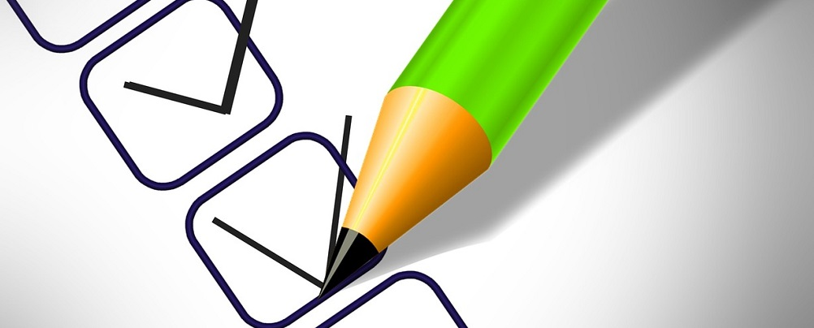

# Тестирование карандаша

Тестирование карандаша, ручки, двери и т.п. явялется растространенным вопросом на QA собеседованиях. В данном репозитории описано тестирование карандаша.

## Требования

1. Характеристики карандаша:
    * Цвет: зеленый;
    * Карнадаш заточен;
    * На противоположном конце карандаша встроена резинка.
2. Карандаш без упаковки.
3. В наличие один экземпляр.

## Тесты

|№|Название теста|Тикет в Azure Devops|
|:-:|--------------|--|
|1|Карандаш пишет на листе бумаги.||
|2|Ластик карандаша стирает написанный им текст.||
|3|Карандаш легко затачивается обычной точилкой.||
|4|Карандаш нормально пишет на другой поверхности, например: ватман, лист картона, деревянный стол, бетон.||
|5|Ластик карандаша стирает текст, написанный с использованием других карандашей.||
|6|Ластик карандаша не стирает текст, написанный с использованием других пишушщих инструментов (например, ручка).||
|7|При слабом нажатии на поверхность карандаш оставляет разборчивый текст на поверхности.||
|8|Грифель карандаша не ломается при среднем нажатии на поверхность.||
|9|Ластик не выскакивает из карандаша при активном стирании.||
|10|Карандаш не ломается при несильном нажатии на поверхность.||
|11|Карандаш удобно лежит в руке.||
|12|Отсутствие резких запахов и следов на руке при использовании карандаша.||
|13|Карандаш пишет на влажной повехности.||
